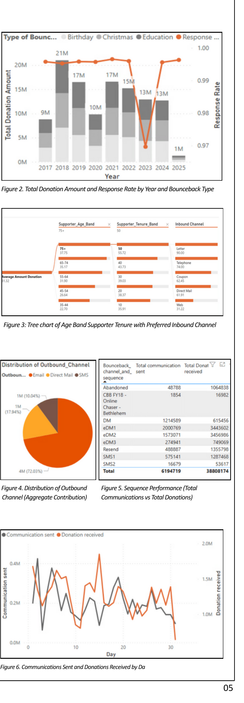
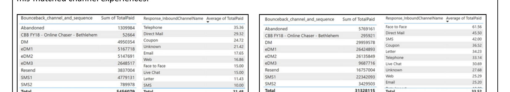
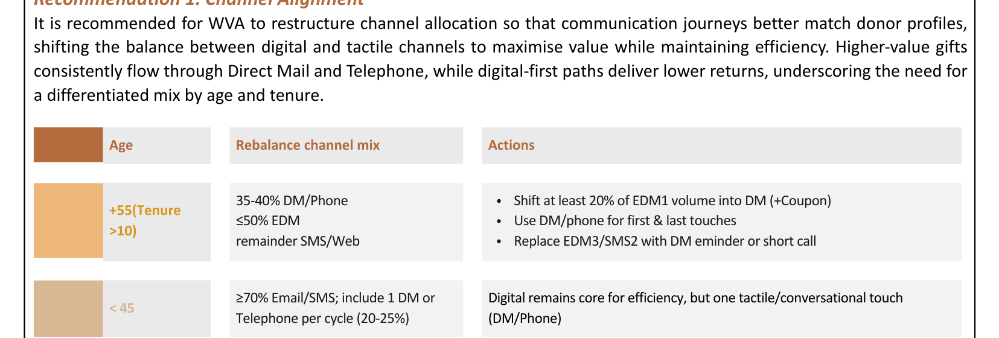

# World Vision Australia: BounceBack Campaign Decision Analytics

Decision analytics project examining donor behaviour, campaign performance, communication channels and predictive patterns for World Vision Australia's BounceBack campaign, a fundraising initiative that generates one-off donations from existing child sponsors through milestone appeals (Birthday, Christmas, Education).

## The problem

**Donation values have declined from $21M in 2018 to just $1M in 2025**, despite the campaign maintaining a stable ~99% response rate throughout. The campaign still reaches donors; it just converts far less value per contact than it used to.

  

## What's driving the decline

**Tenure and age are the strongest predictors of donation value, but the highest-value donors are being routed through the weakest channels.**

- Donors aged 65+ contribute the highest average donation: **$31.32/gift**. Long-tenured supporters (50+ years) average even more, at **$55.72/donation**.
- Letters ($90) and Telephone ($74) generate far higher average donation value than digital channels like Web ($31.22), yet **Email accounts for 72% of all outbound communication**, against 18% Direct Mail and 10% SMS.
- The pattern holds up when segmented by age band and sequence step:

  

Over-55 supporters responding via Telephone average $35.36 per gift and via Direct Mail $29.32, both well above their Email/Web response average. Under-45 supporters show the same channel ranking, just at lower absolute values.

**Timing is also misaligned with donor readiness.** Donations peak around Day 15 of the cycle, but outbound activity is concentrated in Week 1 and again late (Days 18-20), under-serving the mid-cycle window when donors are most likely to give.

**Diminishing returns set in fast.** The first three touches (DM, eDM1, eDM2) deliver the strongest returns; by the third follow-up (eDM3, SMS2), incremental revenue is negligible despite continued send volume.

## Recommendations

1. **Rebalance channel allocation**: shift at least 20% of EDM1 volume for older/long-tenure donors (55+, 10+ years) into Direct Mail and phone, while keeping digital as the core channel for younger, shorter-tenure donors.

  

2. **Optimise timing around donor readiness**: concentrate the strongest asks in Days 13-21 (the conversion peak), and shift post-Day 21 contact toward lighter, stewardship-style messaging rather than another hard ask.
3. **Personalise ask framing**: replace the flat $20-45 ask ladder for non-responders with amounts anchored to donor capacity and tenure, since younger donors typically give $20-30 while long-tenured donors (40+ years) often reach $500.

Implementing these changes is projected to reduce wasted communication volume, protect supporter goodwill, and recover higher-value gifts from the loyal donor segment that current channel allocation underserves.

## Methodology

- **Descriptive analysis**: donation trends, donor profiles, channel distribution, sequencing and timing, from historical campaign data
- **Diagnostic analysis**: tested four hypotheses (channel-supporter alignment, timing vs donor readiness, diminishing returns from repeat contact, ask-ladder suitability) against the descriptive patterns
- **Predictive analysis**: Random Forest models built separately for Birthday, Christmas and Education campaigns; representative decision trees extracted for interpretable rules on tenure, channel and donation value, used as decision support rather than automated targeting

## Tools & techniques

`Predictive Modelling` `Random Forest` `Decision Trees` `Descriptive Analytics` `Diagnostic Analytics` `Campaign Analytics` `Data Visualisation`

## Repository contents

- [`World-Vision-BounceBack-Full-Report.pdf`](World-Vision-BounceBack-Full-Report.pdf): the complete report, including full descriptive/diagnostic/predictive analysis, decision trees, model performance and appendices
- `images/`: charts and tables referenced above
